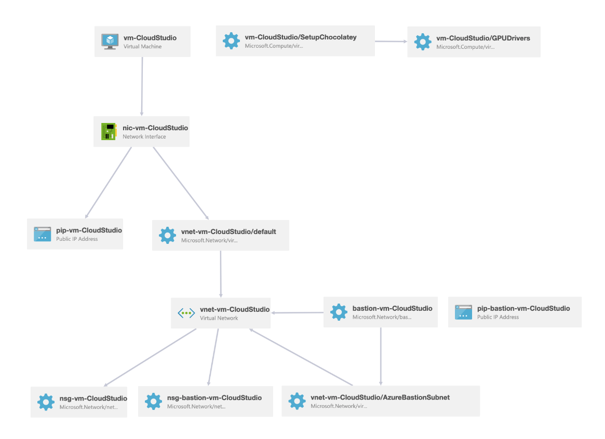

# CloudStudio on Windows 10 GPU VM with Skype, NDI Runtime and OBS-NDI installed


Live streaming is a hardware-intensive endeavor. Instead of buying your own hardware, it's better to leverage Azure.

This repository provides...

* ...an ARM template to deploy a powerful Windows 10 GPU VM and the network infrastructure required to access it with Azure Bastion.
* ...a PowerShell script to install all software required for streaming (OBS, Skype, ...)

We call this combination of streaming related software and Azure compute resources "CloudStudio".

To use CloudStudio, follow these instructions:

## Step 1/2: Deploy the VM

The repo contains a deployment file [azuredeploy.json](azuredeploy.json) to set up the VM. The easiest way to deploy the VM is by clicking the "Deploy to Azure" button (you can visualize what's being deployed by clicking the "Visualize" button):

[](https://portal.azure.com/#create/Microsoft.Template/uri/https%3A%2F%2Fraw.githubusercontent.com%2Fkphillpotts%2FCloudStudio%2Fmaster%2Fazuredeploy.json)  

[](http://armviz.io/#/?load=https%3A%2F%2Fraw.githubusercontent.com%2Fkphillpotts%2FCloudStudio%2Fmaster%2Fazuredeploy.json)

### Important notes

The virtual machine and all resources will be **deployed into the same region as the resource group** specified. The selection of a different region has no effect on the deployment.

Make sure to deploy the resource group into a region supporting NV-Series VMs. You can find a [complete list here](https://azure.microsoft.com/global-infrastructure/services/?products=virtual-machines&regions=non-regional,us-east,us-east-2,us-central,us-north-central,us-south-central,us-west-central,us-west,us-west-2,canada-east,canada-central,europe-north,europe-west,australia-central,australia-central-2,australia-east,australia-southeast,brazil-south,china-non-regional,china-east,china-east-2,china-north,china-north-2,south-africa-north,south-africa-west). By the time of writing, this is the list of supported regions. The ones we actively tested are shown in **bold**:

* Australia East
* **West Europe**
* North Europe
* **East US**
* East US 2
* North Central US
* **South Central US**
* West US 2

### How to choose a VM size

We recommend using a `Standard_NV6` size VM. We found this powerful enough to handle the streaming infrastructure.
The ARM template allows you to select a different size, if needed.

### Access the VM through Azure portal

When deployment is done, access the VM using Bastion's RDP:

* In Azure portal, go to the overview page of the deployed VM
* Click "Connect" in the top menu bar and select "Bastion"
* Enter the username and password provided in the ARM template

## Step 2/2: Install software

Software installation is based on a [PowerShell script](CloudStudioInstallscript.ps1) using Chocolatey package manager and by running other installers silently.

* Login to the VM using an RDP session (Azure Bastion, see above)
* Press "WINDOWS+R" to execute a command

Paste the following command to download the installation script to the VM:

```
powershell -command "Invoke-WebRequest -Uri https://raw.githubusercontent.com/Krumelur/CloudStudio/master/CloudStudioInstallScript.ps1 -OutFile ~/Desktop/CloudStudioInstallScript.ps1 -UseBasicParsing"
```

* Check your Desktop and you should see a file called "CloudStudioInstallScript.ps".
* Press "WINDOWS+R" to execute another command

Paste the following command start the installation process:

```
powershell -ExecutionPolicy bypass -file %USERPROFILE%/Desktop/CloudStudioInstallScript.ps1
```

The installation can take up to 20 minutes.

When done, reboot the VM.

## Details about deployed Resources

Here's an overview of the deployed topology:



The following resources will be created

* Virtual Machine
* Network Interface
* Virtual Network
* VM public IP address with DNS
* Network Security group (with HTTP, SSL and OBS web socket ports opened)
* Azure Bastion
* Azure Bastion public IP address with DNS

GPU drivers are installed via NVIDIA extension for Virtual Machines. More details at https://docs.microsoft.com/en-us/azure/virtual-machines/windows/n-series-driver-setup.

### Software installed

* Skype - <https://chocolatey.org/packages/skype>
* OBS Studio - <https://chocolatey.org/packages/obs-studio>
* OBS web socket extension
* OBS NDI plugin
* Microsoft Edge
* Snaz
* NewTek NDI runtime

## Credits

- This script is originally based on the Azure Quickstart Template <https://azure.microsoft.com/en-us/resources/templates/obs-studio-stream-vm-chocolatey/>
- Much thanks to Simon Lamb <https://github.com/slamb2k> for adding in the Bastion Components

## TODO

- [x] Script installation of Snaz for countdown timer <https://github.com/JimmyAppelt/Snaz/releases>
- [x] Script installation of OBS Websocket Plugin <https://github.com/Palakis/obs-websocket/releases>
- [x] Script installation of OBS-NDI Plugin <https://github.com/Palakis/obs-ndi/releases>
- [x] Script installation of NDI Runtime <https://ndi.tv/tools/>
- [x] Update ARM Template to open port for OBS Websocket (with default to 4444)
- [ ] Guidance page for configuring settings in OBS
- [ ] Import default scene collection into OBS